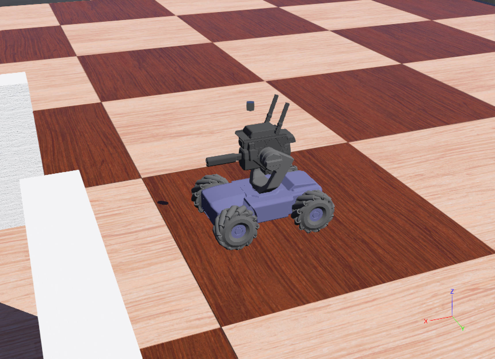
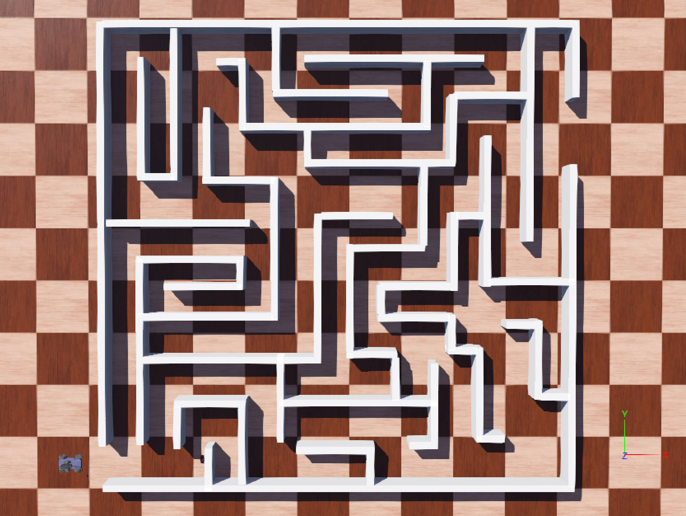
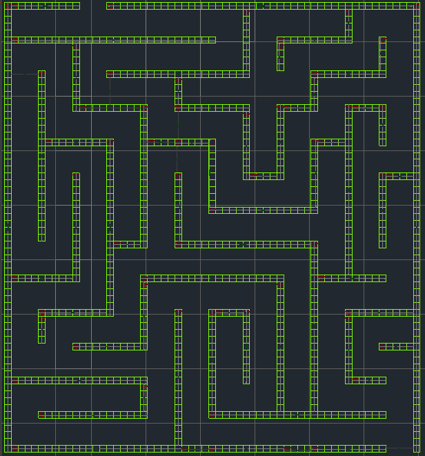
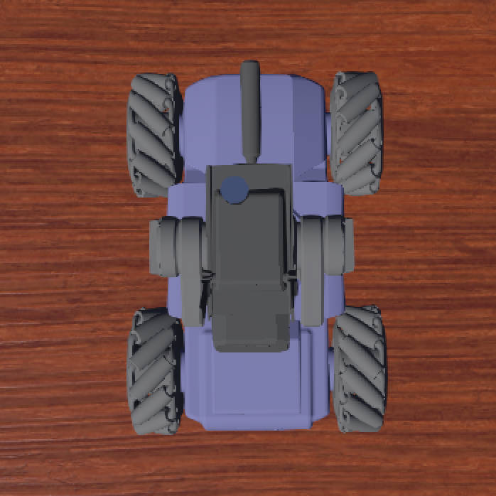
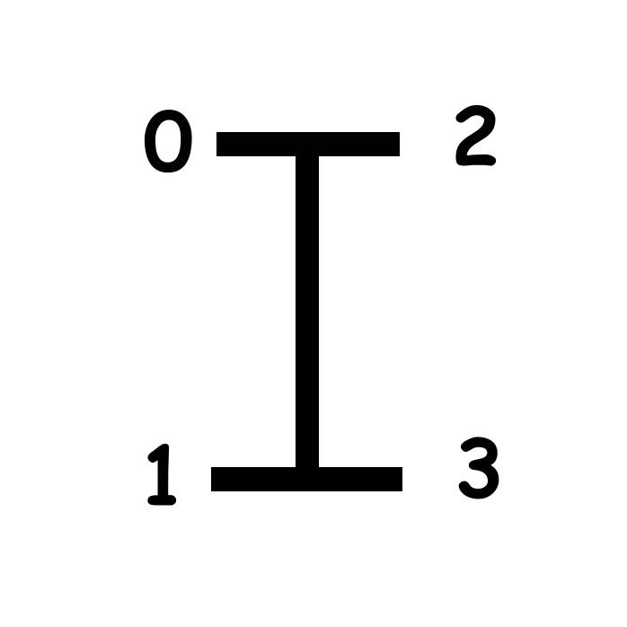
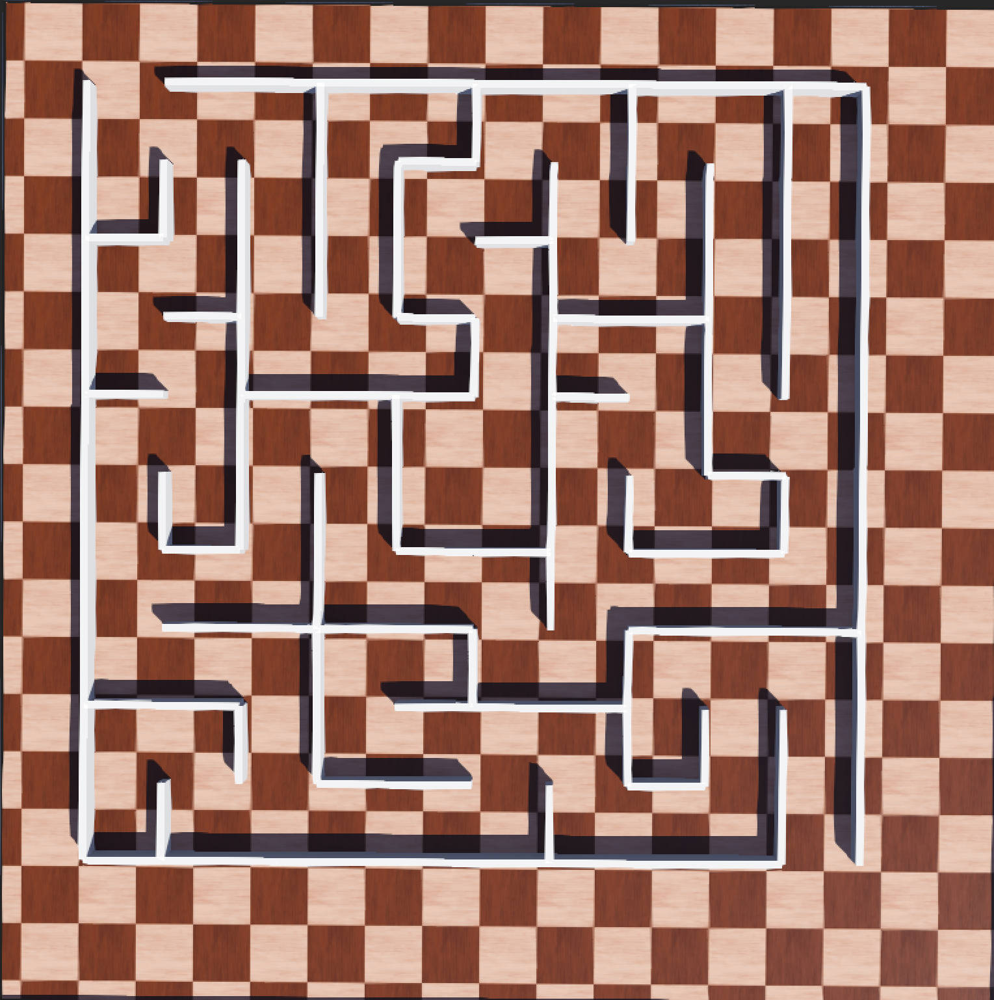

# RoboMasterS1 MazeSimulation
| [English](README.md) | [简体中文](README_CN.md) |

<div align="center">
  <div style="display: flex; justify-content: center;">
    
    
    <!--  -->
  </div>
</div>

## Introduction📰
​    RoboMasterS1 MazeSimulation is a robot maze simulation project based on webots. The model used is DJI RoboMasterS1, and it provides a scaled artificially modeled maze Maze01.wbt, a maze generator with definable width and height based on the depth-first search (DFS) algorithm.

## Attention⚠️
* Currently only the Python version of the controller is supported. If you want to use more language versions of the controller code, please develop it yourself. We look forward to your high-quality code.  
* And the code is only supported on Windows and may encounter issues when running on Linux.

## Development🖥️
​    The description only represents the development environment of this repository and does not represent any software version restriction information.
* Windows 10 Professional
* Webots R2023b Vision 1
* Python 3.7

## Goals🎖️
​    To complete the exploration of the maze, enter from the entrance in the lower right corner and leave from the exit in the upper left corner (there is only one and only path). Complete the RobotController class in controllers/S1_PyController.py and return the ASCII code to simulate the typing operation, and realize the control of the S1 model. I hope you can combine the model's sensors, cameras and other simulation parts to implement more different strategies to explore the maze.

## Quick Start💡
### Wheels Idx Mapping Description
​    In order to facilitate direct access to the Mecanum wheel of the S1 model, an index diagram of each wheel in the model is provided here. Motor motor and sensor are provided in each Mecanum wheel，[0-fl-front left] [1-bl-back left] [2-fr-front right] [3-br-back right]
<div align="center">
  <div style="display: flex; justify-content: center;">
    
    
  </div>
</div>

### Instruction Description
| Instruction | Mapping | Description | 
| :---------: | :------: | :--------: | 
|  W  | Forward | Make the S1 model move vertically forward |
|  S  | Backward | Make the S1 model move vertically backword |
|  A  | Pan Left | Make the S1 model horizontally to the left |
|  D  | Pan Right | Make the S1 model horizontally to the right |
| Q | Turn left around the center of the chassis | Make the S1 model turn left around the center of the chassis |
| E | Turn right around the center of the chassis | Make the S1 model turn right around the center of the chassis |
|  ↑  | Pitch axis raised | Increase the pitch angle of the S1 model shooter |
|  ↓  | Pitch axis down | Decrease the pitch angle of the S1 model launcher |
|  ←  | YAW axis rotates clockwise | Make the S1 model gimbal rotate clockwise (yaw angle increases) |
|  →  | YAW axis rotates counterclockwise | Make the S1 model gimbal rotate counterclockwise (yaw angle decreases) |


### Automatic Maze Generation 
#### How to generate a maze?
​    Provide a maze generator with definable width and height based on the depth-first search (DFS) algorithm. Will generate maze.gbt in folder maze_generator/output
```
$ cd maze_generator
$ python Maze_Generator.py
[INFO] Maze Generator
[INPUT] Enter the number of rows (greater than 4): 10
[INPUT] Enter the number of columns (greater than 4): 10
[INFO] Generate a 10 x 10 maze
[INFO] Here's the maze you asked for. A maze.wbt has been created.
#   # # # # # # # # # # # # # # # # # # # 
#           #       #       #       #   # 
#   #   #   #   # # #   #   #   #   #   # 
#   #   #   #   #       #   #   #   #   # 
# # #   #   #   #   # # #   #   #   #   # 
#       #   #   #       #       #   #   # 
#   # # #   #   # # #   # # # # #   #   # 
#       #           #   #       #   #   # 
# # #   # # # # # # #   # # #   #   #   # 
#       #       #       #       #       # 
#   #   #   #   #   #   #   #   # # #   # 
#   #   #   #   #       #   #       #   # 
#   # # #   #   # # # # #   # # # # #   # 
#           #           #               # 
#   # # # # # # # # #   #   # # # # # # # 
#           #       #       #           # 
# # # # #   #   # # # # # # #   #   #   # 
#       #   #               #   #   #   # 
#   #   #   # # # # #   #   # # #   #   # 
#   #                   #           #   #
# # # # # # # # # # # # # # # # # # #   #
```
​    The model generated by the above maze is as follows：
<div align="center">
  <div style="display: flex; justify-content: center;">
    
  </div>
</div>
* Please do not modify the content of the WorldInfo part of the _display_maze function in Maze_Generator.py at will, which may cause the coordinate system to be confused or the Mecanum wheel to be unable to achieve left/right translation.

#### How to import S1 models in maze?
​    Since there are too many points in the S1 model, it cannot be imported directly like in WorldInfo. A better solution has not yet been found. Currently, copy-paste is still used to paste all the text in robot.wbt into the generated maze. wbt file end, and manually bind the controller


## Tutorials
​    Here are some websites and documents that I personally find helpful in learning webots.
* [古月居/罗伯特祥](https://www.guyuehome.com/author/60ab3d2d266b9)
* [Introduction to Webots](documents/Introduction%20to%20Webots.pdf)

## References
​     During the construction of this project, the following repositories were used as references. We are very grateful for their contributions.
* [PriyankaPrakashChand/Micromouse_E-Puck](https://github.com/PriyankaPrakashChand/Micromouse_E-Puck)
* [PeytomX/RoboMasterS1_Webots](https://github.com/PeytomX/RoboMasterS1_Webots.git)

## LICENSE
​    This project is licensed under the MIT License.