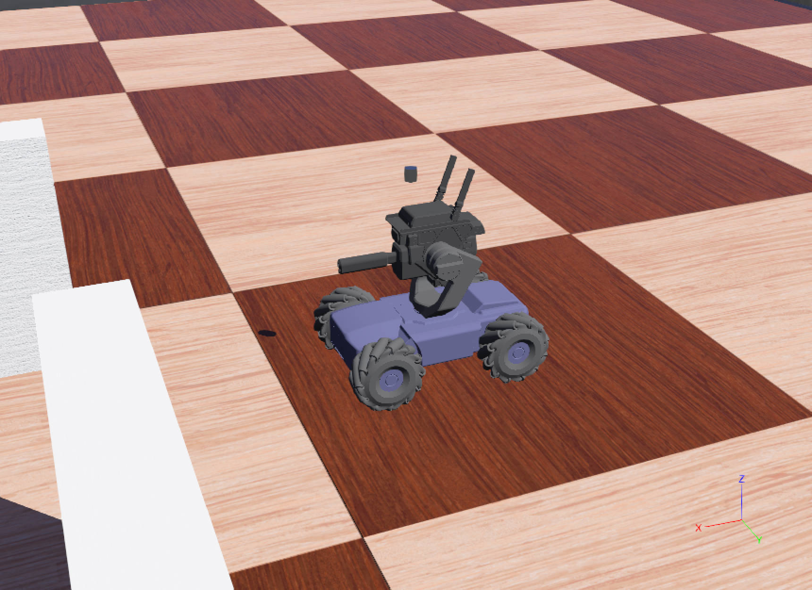
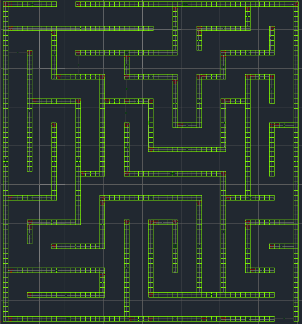
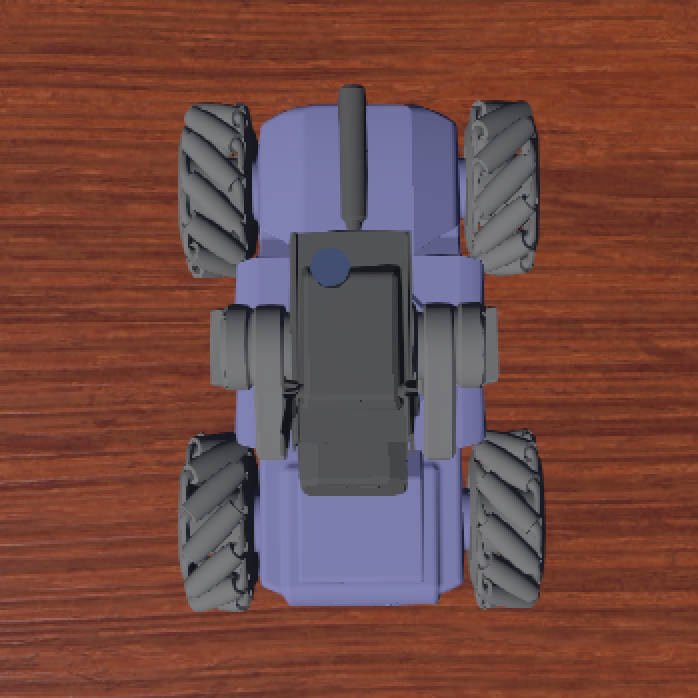
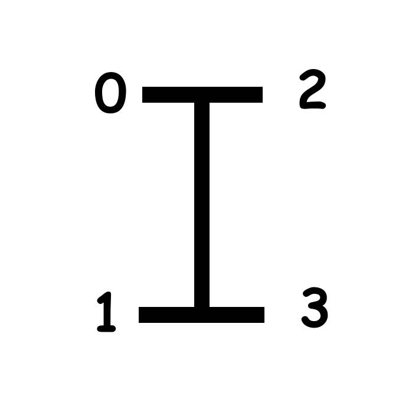
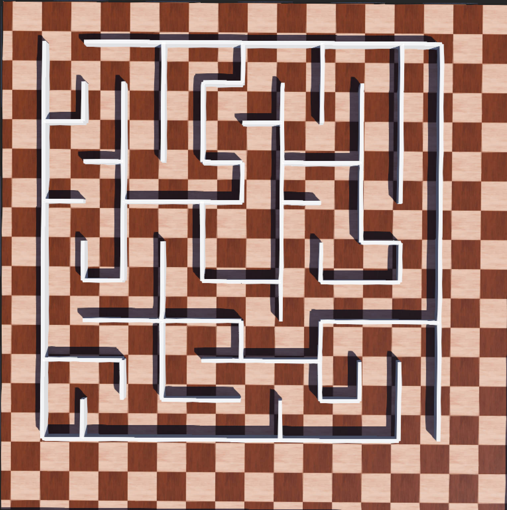

# RoboMasterS1 MazeSimulation
| [English](README.md) | [简体中文](README_CN.md) |

<div align="center">
  <div style="display: flex; justify-content: center;">
    
    
    <!--  -->
  </div>
</div>

## 介绍📰
​     RoboMasterS1 MazeSimulation是一个基于webots的机器人迷宫模拟项目。 使用的模型是DJI RoboMasterS1，它提供了一个缩放的人工建模迷宫Maze01.wbt，一个基于深度优先搜索（DFS）算法的可定义宽度和高度的迷宫生成器。

## 注意⚠️
* 目前仅支持Python版本的控制器。 如果您想使用更多语言版本的控制器代码，请自行开发。 我们期待您的高质量代码。
* 并且该代码仅在Windows上进行开发与测试，在 Linux 上运行时可能会遇到问题。

## 开发环境🖥️
​     描述仅代表本仓库的开发环境，不代表任何软件版本的限制信息
* Windows 10 Professional
* Webots R2023b Vision 1
* Python 3.7

## 目标🎖️
​    要完成迷宫的探索，从右下角的入口进入，从左上角的出口离开（只有一条且唯一的路径）。 完成controllers/S1_PyController.py中的RobotController类，返回ASCII码模拟键入操作，实现对于S1模型的控制。 希望大家能够结合模型的传感器、摄像头等模拟部分，实现更多不同的策略来探索迷宫。

## 快速开始💡
### 麦卡纳姆轮映射说明
​    为了方便直接对于S1模型的麦卡纳姆轮进行访问，此处提供模型中各轮的索引示意图。每个麦卡纳姆轮中提供motor电机和sensor传感器，[0-左前] [1-左后] [2-右前] [3-右后]
<div align="center">
  <div style="display: flex; justify-content: center;">
    
    
  </div>
</div>

### 操作指令说明
| 指令 | 映射 | 说明 | 
| :---------: | :------: | :--------: | 
|  W  | 前进 | 使S1模型垂直方向上朝正前方行动 |
|  S  | 后退 | 使S1模型垂直方向上朝正后方行动 |
|  A  | 向左平移 | 使S1模型水平方向上向左平移 |
|  D  | 向右平移 | 使S1模型水平方向上向右平移 |
|  Q  | 绕底盘中心左转 | 使S1模型绕底盘中心进行左转 |
|  E  | 绕底盘中心右转 | 使S1模型绕底盘中心进行右转 |
|  ↑  | 发射器抬头 | 使S1模型发射器俯仰角增大 |
|  ↓  | 发射器低头 | 使S1模型发射器俯仰角减少 |
|  ←  | 云台顺时针旋转 | 使S1模型云台顺时针旋转（偏航角增大） |
|  →  | 云台逆时针旋转 | 使S1模型云台逆时针旋转（偏航角减小） |

### 自动生成迷宫
#### 如何进行迷宫的生成？
​    基于深度优先搜索 (DFS) 算法，提供具有可定义宽度和高度的迷宫生成器。 将在文件夹 maze_generator/output 中生成 maze.gbt
```
$ cd maze_generator
$ python Maze_Generator.py
[INFO] Maze Generator
[INPUT] Enter the number of rows (greater than 4): 10
[INPUT] Enter the number of columns (greater than 4): 10
[INFO] Generate a 10 x 10 maze
[INFO] Here's the maze you asked for. A maze.wbt has been created.
#   # # # # # # # # # # # # # # # # # # # 
#           #       #       #       #   # 
#   #   #   #   # # #   #   #   #   #   # 
#   #   #   #   #       #   #   #   #   # 
# # #   #   #   #   # # #   #   #   #   # 
#       #   #   #       #       #   #   # 
#   # # #   #   # # #   # # # # #   #   # 
#       #           #   #       #   #   # 
# # #   # # # # # # #   # # #   #   #   # 
#       #       #       #       #       # 
#   #   #   #   #   #   #   #   # # #   # 
#   #   #   #   #       #   #       #   # 
#   # # #   #   # # # # #   # # # # #   # 
#           #           #               # 
#   # # # # # # # # #   #   # # # # # # # 
#           #       #       #           # 
# # # # #   #   # # # # # # #   #   #   # 
#       #   #               #   #   #   # 
#   #   #   # # # # #   #   # # #   #   # 
#   #                   #           #   #
# # # # # # # # # # # # # # # # # # #   #
```
​    上述迷宫生成的模型如下所示：
<div align="center">
  <div style="display: flex; justify-content: center;">
    
  </div>
</div>
* 请勿随意修改Maze_Generator.py中_display_maze函数中的WorldInfo部分的内容，可能导致坐标系的错乱或者麦卡纳姆轮无法实现左/右平移

#### 如何在迷宫中导入模型？
​    由于S1模型的点的数量过多，无法像WorldInfo中那样直接进行导入，仍然没有找到较好的解决方案，目前仍然使用复制-粘贴的方式将robot.wbt中的所有文本粘贴到生成的maze.wbt文件末端，并手动绑定controller

## 教程
​    此处提供一些个人觉得有助于webots学习的网站及文档
* [古月居/罗伯特祥](https://www.guyuehome.com/author/60ab3d2d266b9)
* [Introduction to Webots](documents/Introduction%20to%20Webots.pdf)

## 参考
​    构建本项目的过程中，对于下述仓库进行了参考，十分感谢他们的贡献
* [PriyankaPrakashChand/Micromouse_E-Puck](https://github.com/PriyankaPrakashChand/Micromouse_E-Puck)
* [PeytomX/RoboMasterS1_Webots](https://github.com/PeytomX/RoboMasterS1_Webots.git)

## 许可
​    本项目的发布受MIT许可认证。